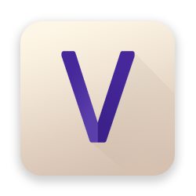

* Backend repository here: https://github.com/kaupunki-apina/prahapp-backend/

* Originally based on https://github.com/futurice/wappuapp-client

# Vask! App

> App to Praise our Culture

## Vask_
> When the rich and spoiled youth of Stureplan in Stockholm, Sweden were forbidden to spray champagne on each other while they were in a bar or club as a way to show everyone around them how much money they could afford to throw away for no good reason, they invented "vaskning" or "att vaska”
Basically it means that you order two expensive bottles of champagne (or any other expensive baverage, but champagne has the highest impact factor), but you tell the bartender to pour one of the bottles in the sink (sink= vask in swedish). This sends a clear signal to the people around you that you are the shit and girls will magically be drawn towards you.

### Features:
* Auth0 login
* Feed with images, text and comments
* Event Calendar
* Event Map with cateogry filters
* Event links

### Architecture
* React Native + Redux
* iOS and Android support
* Selectors with [reselect](https://github.com/reactjs/reselect/) to access store
* Redux architecture using [ducks](https://github.com/erikras/ducks-modular-redux). See `/app/concepts`
* Data processing in _concepts_ and minimize logic in views

## Local development

**BEFORE JUMPING TO IOS OR ANDROID GUIDE, FOLLOW THESE GUIDES:**

* https://facebook.github.io/react-native/docs/getting-started.html
* (Optional) https://facebook.github.io/react-native/docs/debugging.html#content
* `npm install` (you might need to use npm@2 version)
* `cp env.example.js env.js` and fill in the blank secrets in the file
* `react-native link`

### iOS

The xcode-project is expecting that you have nvm installed. It can be reconfigured in
`Build Phases > Bundle React Native code and images`.

- [Install Cocoapods](https://guides.cocoapods.org/using/getting-started.html#installation)
- `cd ios && pod install`
- `open prahappclient.xcworkspace`

  **Note:** Use the .xworkspace instead of .xcodeproj!

### Android

- Android Emulator suggestion: install and start [Genymotion](https://www.genymotion.com)
- Or connect your Android device with usb cable
- `react-native run-android`

## Release

### iOS

* Make sure you have latest App Store provisioning profile installed
* Package production script bundle with `npm run release:ios`
* In XCode project settings, bump Version field
* Choose `Generic iOS Device` (or a connected iPhone) as build target
* Run `Product > Clean` (for paranoia) and `Product > Archive`
* Go to `Window > Organizer`, select latest build with correct version and press Upload to App Store

### Android

* Setup Android environment: https://facebook.github.io/react-native/docs/android-setup.html#content
* Copy `whappu-release.keystore` under `android/app` if it's not there already.
* Bump `versionCode` and `versionName` in `android/app/build.gradle`
* `cd android && ./gradlew assembleRelease --no-daemon`
* Built .apk is saved to `android/app/build/outputs/apk`

### Common problems

Try these:

* Google: e.g. `react native Naming collision detected` almost always provides
useful resources to fix problems
* Search [react-native issues](https://github.com/facebook/react-native)
* Search from the react native component's issues

- `error: /Users/user/code/prahapp/prahapp-client/node_modules/react-native-vector-icons/Fonts/MaterialCommunityIcons.ttf: No such file or directory`
  - Download the from [here](https://github.com/oblador/react-native-vector-icons/raw/master/Fonts/MaterialCommunityIcons.ttf) and move it to `/node_modules/react-native-vector-icons/Fonts`
- Cmd + R

#### Could not connect to development server

Make sure:

* React native packager is running (`npm start`)
* You have configured React native correctly: https://facebook.github.io/react-native/docs/getting-started.html
* Your mobile phone is connected to same wifi as your computer

#### Loading from <your-ip>:8081...

Stuck at the white screen? It may take even minutes to do the initial load..

## Contributing

Found a bug? Can't live without a feature? Submit a pull request, or if you want to get paid, [apply for a job at Futurice](http://futurice.com/careers) in Tampere, Helsinki, Stockholm, London, Berlin, or Munich.
